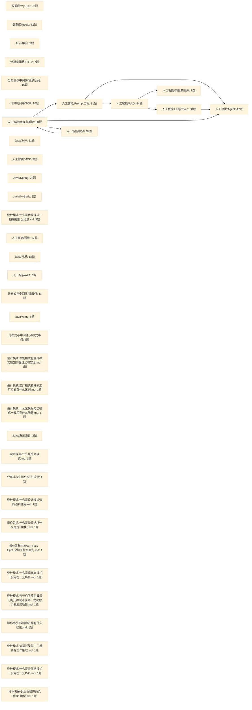
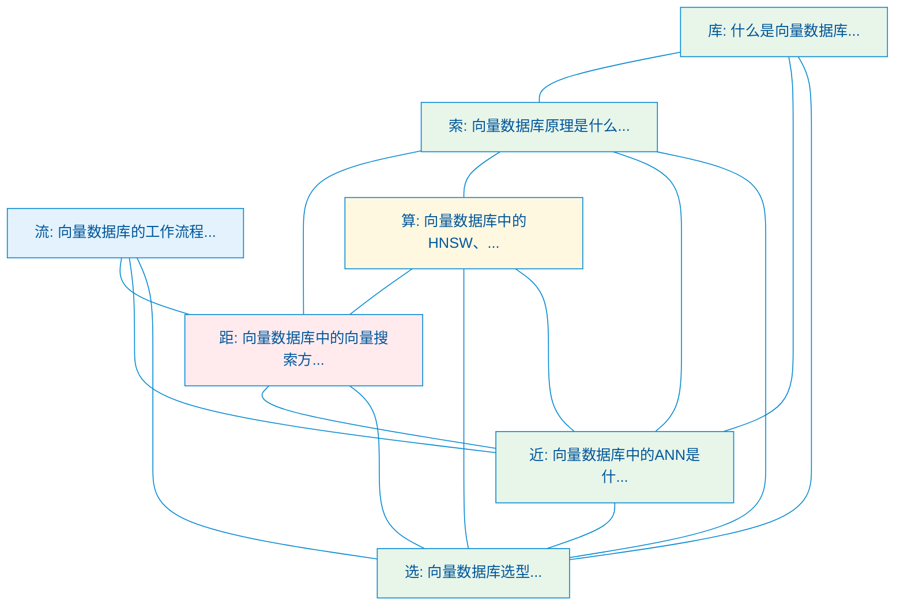

# 面试记忆全局知识关联图谱

> 覆盖 512 个知识点的跨领域关联图，每个知识点之间用箭头标注关联关系。

---

## 全局知识领域总览图

---

## 人工智能/大模型基础 知识关联图

```mermaid
graph TD
    %%{init: {'theme': 'base', 'themeVariables': { 'primaryColor': '#e1f5fe', 'primaryTextColor': '#01579b', 'primaryBorderColor': '#0288d1', 'lineColor': '#0288d1', 'secondaryColor': '#fff3e0', 'tertiaryColor': '#e8f5e9'}}}%%

    个["个: 解释一个 LSTM 单元..."]
    style 个 fill:#fff8e1
    交["交: ReAct是什么..."]
    style 交 fill:#e8f5e9
    似["似: RAG 中如何计算文本相..."]
    style 似 fill:#ffebee
    位["位: Transformer ..."]
    style 位 fill:#e8f5e9
    何["何: BERT 是如何处理自然..."]
    style 何 fill:#e3f2fd
    入["入: 什么是词嵌入（Word ..."]
    style 入 fill:#e8f5e9
    力["力: Transformer ..."]
    style 力 fill:#e3f2fd
    匠["匠: 什么是 Agentic ..."]
    style 匠 fill:#ffebee
    协["协: 什么是 ACP 协议它有..."]
    style 协 fill:#fff8e1
    双["双: chatGLM 和 GP..."]
    style 双 fill:#ffebee
    口["口: 当大模型上下文窗口扩展到..."]
    style 口 fill:#fff8e1
    可["可: K 和 Q 可以使用同一..."]
    style 可 fill:#e8f5e9
    后["后: 什么是 Backgrou..."]
    style 后 fill:#e8f5e9
    图["图: 了解 ViT（Visio..."]
    style 图 fill:#e8f5e9
    在["在: 在文本分类任务中，如何处..."]
    style 在 fill:#e8f5e9
    场["场: 现场实操：给定一个包含数..."]
    style 场 fill:#e3f2fd
    基["基: 简述 LLaMA（Lar..."]
    style 基 fill:#e3f2fd
    境["境: 聊一聊 ELMo 技术，..."]
    style 境 fill:#e8f5e9
    头["头: 为什么 Transfor..."]
    style 头 fill:#e8f5e9
    子["子: 说说 FastText ..."]
    style 子 fill:#ffebee
    尾["尾: 设计智能客服系统时，如何..."]
    style 尾 fill:#e3f2fd
    层["层: Transformer ..."]
    style 层 fill:#ffebee
    嵌["嵌: 简述 Word Embe..."]
    style 嵌 fill:#e3f2fd
    并["并: 使用 Transform..."]
    style 并 fill:#ffebee
    幻["幻: 什么是 AI 幻觉（Ha..."]
    style 幻 fill:#e8f5e9
    度["度: 什么是深度思考（Deep..."]
    style 度 fill:#ffebee
    归["归: 什么是自回归属性（aut..."]
    style 归 fill:#e8f5e9
    当["当: 当大模型API响应延迟超..."]
    style 当 fill:#fff8e1
    据["据: Transformer ..."]
    style 据 fill:#e3f2fd
    描["描: 请描述 BERT 模型的..."]
    style 描 fill:#e8f5e9
    操["操: Computer Use..."]
    style 操 fill:#e8f5e9
    旋["旋: 了解 LLaMA 中的旋..."]
    style 旋 fill:#e8f5e9
    映["映: Transformer ..."]
    style 映 fill:#e3f2fd
    显["显: Transformer ..."]
    style 显 fill:#e8f5e9
    本["本: 本地部署大模型和调用云端..."]
    style 本 fill:#ffebee
    机["机: 什么是 Token 缓存..."]
    style 机 fill:#e8f5e9
    来["来: self attenti..."]
    style 来 fill:#e8f5e9
    构["构: 聊一聊 Transfor..."]
    style 构 fill:#e3f2fd
    果["果: 如果让 K 和 Q 变成..."]
    style 果 fill:#e8f5e9
    架["架: Transformer ..."]
    style 架 fill:#ffebee
    栏["栏: 什么是护栏技术..."]
    style 栏 fill:#e8f5e9
    树["树: 解释 hierarchi..."]
    style 树 fill:#e3f2fd
    样["样: Word2Vec 到 B..."]
    style 样 fill:#ffebee
    格["格: 什么是结构化输出 Spr..."]
    style 格 fill:#e8f5e9
    步["步: 什么是 CoT 思维链如..."]
    style 步 fill:#e8f5e9
    残["残: Transformer ..."]
    style 残 fill:#e8f5e9
    测["测: Transformer ..."]
    style 测 fill:#fff8e1
    涌["涌: 什么是大模型的涌现能力？..."]
    style 涌 fill:#fff8e1
    滑["滑: 你有什么办法可以比较好地..."]
    style 滑 fill:#e3f2fd
    点["点: Transformer ..."]
    style 点 fill:#e8f5e9
    焦["焦: 什么是注意力机制？它是如..."]
    style 焦 fill:#e8f5e9
    现["现: 现有文本分类算法在处理多..."]
    style 现 fill:#fff8e1
    用["用: LLaMA 有哪些实际应..."]
    style 用 fill:#fff8e1
    甲["甲: 什么是Manus..."]
    style 甲 fill:#e8f5e9
    矩["矩: 说说 GloVE 技术，..."]
    style 矩 fill:#ffebee
    码["码: 讲一下你对 Transf..."]
    style 码 fill:#e3f2fd
    窗["窗: Word2Vec 如何获..."]
    style 窗 fill:#e3f2fd
    简["简: LSTM 和 GRU 有..."]
    style 简 fill:#ffebee
    结["结: 大模型的结构化输出..."]
    style 结 fill:#e8f5e9
    络["络: 请解释 LSTM 和 G..."]
    style 络 fill:#e3f2fd
    缓["缓: 什么是GPTCache..."]
    style 缓 fill:#e8f5e9
    编["编: 什么是Google AD..."]
    style 编 fill:#fff8e1
    罩["罩: BERT 怎样进行 ma..."]
    style 罩 fill:#ffebee
    蒸["蒸: 什么是模型蒸馏（Know..."]
    style 蒸 fill:#ffebee
    藏["藏: LSTM 中，隐藏状态（..."]
    style 藏 fill:#ffebee
    融["融: ViLT 模型是如何将 ..."]
    style 融 fill:#e3f2fd
    融["融: 了解 ViLT（Visi..."]
    style 融 fill:#e8f5e9
    衡["衡: 在文本分类任务中，如何处..."]
    style 衡 fill:#fff8e1
    觉["觉: 你觉得可以怎样缓解这个性..."]
    style 觉 fill:#e3f2fd
    计["计: 大模型的 Token 是..."]
    style 计 fill:#ffebee
    训["训: 是否使用 Word2Ve..."]
    style 训 fill:#e3f2fd
    记["记: 大模型的长短期记忆机制..."]
    style 记 fill:#e8f5e9
    负["负: 说一说负采样技术在 Wo..."]
    style 负 fill:#e3f2fd
    边["边: 支持向量机可以用于文本分..."]
    style 边 fill:#e3f2fd
    进["进: 在进行多头注意力的时候需..."]
    style 进 fill:#e8f5e9
    速["速: Word2Vec 有哪些..."]
    style 速 fill:#fff8e1
    遮["遮: Transformer ..."]
    style 遮 fill:#ffebee
    长["长: 当需要处理超长大模型上下..."]
    style 长 fill:#fff8e1
    门["门: 与循环神经网络（RNN）..."]
    style 门 fill:#e8f5e9
    颈["颈: Transformer ..."]
    style 颈 fill:#e8f5e9

    个 --- 藏
    个 --- 门
    个 --- 络
    交 --- 操
    交 --- 颈
    交 --- 门
    似 --- 遮
    似 --- 计
    似 --- 藏
    位 --- 颈
    位 --- 融
    位 --- 点
    何 --- 滑
    何 --- 样
    何 --- 描
    入 --- 嵌
    入 --- 速
    入 --- 负
    力 --- 融
    力 --- 码
    力 --- 构
    匠 --- 藏
    匠 --- 罩
    匠 --- 简
    协 --- 颈
    协 --- 门
    协 --- 长
    双 --- 遮
    双 --- 计
    双 --- 藏
    口 --- 颈
    口 --- 门
    口 --- 长
    可 --- 颈
    可 --- 门
    可 --- 长
    后 --- 格
    后 --- 机
    后 --- 度
    图 --- 融
    图 --- 颈
    在 --- 衡
    在 --- 颈
    在 --- 门
    场 --- 基
    场 --- 格
    场 --- 机
    基 --- 融
    境 --- 矩
    境 --- 子
    境 --- 构
    头 --- 颈
    头 --- 融
    头 --- 点
    子 --- 矩
    子 --- 样
    子 --- 速
    尾 --- 边
    尾 --- 负
    尾 --- 训
    层 --- 遮
    层 --- 架
    层 --- 并
    嵌 --- 负
    嵌 --- 训
    并 --- 遮
    并 --- 架
    幻 --- 格
    幻 --- 机
    幻 --- 度
    度 --- 格
    度 --- 机
    归 --- 颈
    归 --- 门
    归 --- 长
    当 --- 场
    当 --- 颈
    当 --- 门
    据 --- 融
    据 --- 码
    据 --- 构
    描 --- 滑
    描 --- 样
    操 --- 颈
    操 --- 门
    旋 --- 用
    旋 --- 基
    旋 --- 颈
    映 --- 融
    映 --- 码
    映 --- 构
    显 --- 颈
    显 --- 融
    显 --- 点
    本 --- 遮
    本 --- 计
    本 --- 藏
    机 --- 计
    机 --- 格
    来 --- 点
    来 --- 残
    来 --- 颈
    构 --- 融
    构 --- 码
    果 --- 颈
    果 --- 门
    果 --- 长
    架 --- 遮
    栏 --- 颈
    栏 --- 门
    栏 --- 长
    树 --- 边
    树 --- 负
    树 --- 训
    样 --- 矩
    样 --- 速
    步 --- 颈
    步 --- 门
    步 --- 长
    残 --- 颈
    残 --- 融
    残 --- 点
    测 --- 颈
    测 --- 遮
    测 --- 融
    涌 --- 颈
    涌 --- 门
    涌 --- 长
    滑 --- 罩
    滑 --- 样
    点 --- 颈
    点 --- 融
    点 --- 测
    焦 --- 颈
    焦 --- 门
    焦 --- 长
    现 --- 颈
    现 --- 门
    现 --- 长
    用 --- 基
    用 --- 颈
    甲 --- 颈
    甲 --- 门
    甲 --- 长
    矩 --- 速
    码 --- 遮
    码 --- 融
    窗 --- 负
    窗 --- 训
    窗 --- 速
    简 --- 藏
    简 --- 络
    简 --- 罩
    结 --- 颈
    结 --- 门
    结 --- 长
    络 --- 藏
    络 --- 门
    缓 --- 颈
    缓 --- 门
    缓 --- 长
    编 --- 颈
    编 --- 门
    编 --- 长
    罩 --- 藏
    罩 --- 矩
    蒸 --- 遮
    蒸 --- 计
    蒸 --- 藏
    融 --- 融
    融 --- 颈
    衡 --- 颈
    衡 --- 门
    觉 --- 边
    觉 --- 负
    觉 --- 训
    计 --- 矩
    计 --- 样
    训 --- 负
    训 --- 速
    记 --- 颈
    记 --- 门
    记 --- 长
    负 --- 速
    边 --- 负
    边 --- 训
    进 --- 颈
    进 --- 门
    进 --- 长
    长 --- 颈
    长 --- 门
    长 --- 遮
    门 --- 矩
    门 --- 藏
```

---

## 人工智能/Prompt工程 知识关联图

```mermaid
graph TD
    %%{init: {'theme': 'base', 'themeVariables': { 'primaryColor': '#e1f5fe', 'primaryTextColor': '#01579b', 'primaryBorderColor': '#0288d1', 'lineColor': '#0288d1', 'secondaryColor': '#fff3e0', 'tertiaryColor': '#e8f5e9'}}}%%

    举["举: 请举例说明假设在电商系统..."]
    style 举 fill:#ffebee
    以["以: 如何选择和设计 Few-..."]
    style 以 fill:#e3f2fd
    价["价: 什么是 Prompt E..."]
    style 价 fill:#e8f5e9
    例["例: 什么是Few-shot ..."]
    style 例 fill:#ffebee
    保["保: 如何保证 AI 应用的性..."]
    style 保 fill:#fff8e1
    假["假: 假设要开发一个智能工单分..."]
    style 假 fill:#e3f2fd
    出["出: 如何让 AI 输出指定格..."]
    style 出 fill:#e3f2fd
    域["域: 如何为不同领域设计专用提..."]
    style 域 fill:#e3f2fd
    实["实: 如何设计提示词来减少AI..."]
    style 实 fill:#fff8e1
    巧["巧: 有哪些设计和优化 Pro..."]
    style 巧 fill:#fff8e1
    我["我: 如何让 AI 进行自我反..."]
    style 我 fill:#e3f2fd
    提["提: 什么是提示词链接 如何实..."]
    style 提 fill:#e3f2fd
    框["框: 要让AI生成一个带表单验..."]
    style 框 fill:#e8f5e9
    注["注: 提示词注入攻击是什么？如..."]
    style 注 fill:#e8f5e9
    洽["洽: 什么是自洽性？如何应用..."]
    style 洽 fill:#e3f2fd
    温["温: temperature和..."]
    style 温 fill:#ffebee
    相["相: 什么是思维树 Tree ..."]
    style 相 fill:#ffebee
    盾["盾: 假设请你设计一个医疗问诊..."]
    style 盾 fill:#e8f5e9
    禁["禁: 什么是负面提示词 在什么..."]
    style 禁 fill:#e8f5e9
    窗["窗: 什么是上下文窗口 Con..."]
    style 窗 fill:#e8f5e9
    符["符: 提示词中的分隔符有什么作..."]
    style 符 fill:#fff8e1
    系["系: 什么是系统提示词 Sys..."]
    style 系 fill:#ffebee
    约["约: 假设需要让大模型生成一个..."]
    style 约 fill:#e8f5e9
    维["维: 提示词优化考虑哪些维度你..."]
    style 维 fill:#fff8e1
    置["置: 如何在提示词中设置约束条..."]
    style 置 fill:#fff8e1
    考["考: 如何让 AI 一步步思考..."]
    style 考 fill:#e3f2fd
    色["色: 什么是角色扮演Role ..."]
    style 色 fill:#e8f5e9
    计["计: Token 是什么如何计..."]
    style 计 fill:#fff8e1
    词["词: 如何使用提示词实现任务分..."]
    style 词 fill:#e3f2fd
    零["零: 零样本 CoT 和少样本..."]
    style 零 fill:#ffebee
    预["预: CBOW 和 Skip-..."]
    style 预 fill:#ffebee

    举 --- 预
    举 --- 零
    举 --- 系
    以 --- 例
    以 --- 词
    以 --- 考
    价 --- 约
    价 --- 框
    价 --- 巧
    例 --- 预
    例 --- 零
    保 --- 考
    保 --- 盾
    保 --- 框
    假 --- 考
    假 --- 我
    假 --- 出
    出 --- 考
    出 --- 我
    域 --- 词
    域 --- 考
    域 --- 洽
    实 --- 考
    实 --- 盾
    实 --- 框
    巧 --- 约
    巧 --- 系
    巧 --- 框
    我 --- 考
    提 --- 词
    提 --- 考
    提 --- 洽
    框 --- 考
    框 --- 约
    框 --- 盾
    注 --- 计
    注 --- 色
    注 --- 考
    洽 --- 考
    洽 --- 我
    温 --- 预
    温 --- 零
    温 --- 系
    相 --- 零
    相 --- 预
    相 --- 系
    盾 --- 考
    盾 --- 我
    禁 --- 计
    禁 --- 色
    禁 --- 考
    窗 --- 计
    窗 --- 色
    窗 --- 考
    符 --- 预
    符 --- 零
    符 --- 词
    系 --- 约
    系 --- 框
    维 --- 预
    维 --- 零
    维 --- 词
    置 --- 预
    置 --- 零
    置 --- 词
    色 --- 计
    色 --- 考
    色 --- 置
    计 --- 预
    计 --- 零
    计 --- 词
    词 --- 考
    词 --- 洽
    零 --- 预
    零 --- 系
    预 --- 系
```

---

## 人工智能/RAG 知识关联图

```mermaid
graph TD
    %%{init: {'theme': 'base', 'themeVariables': { 'primaryColor': '#e1f5fe', 'primaryTextColor': '#01579b', 'primaryBorderColor': '#0288d1', 'lineColor': '#0288d1', 'secondaryColor': '#fff3e0', 'tertiaryColor': '#e8f5e9'}}}%%

    K["K: RAG 检索中的 Top..."]
    style K fill:#e8f5e9
    主["主: RAG的主要流程..."]
    style 主 fill:#e3f2fd
    么["么: 什么是 Spring A..."]
    style 么 fill:#fff8e1
    产["产: RAG 系统在生产环境中..."]
    style 产 fill:#e8f5e9
    优["优: 如何优化 RAG 的检索..."]
    style 优 fill:#fff8e1
    使["使: 使用LangChain实..."]
    style 使 fill:#e8f5e9
    信["信: RAG 系统如何标注信息..."]
    style 信 fill:#e3f2fd
    切["切: RAG 中文档切割的 c..."]
    style 切 fill:#e8f5e9
    利["利: RAG 系统如何利用元数..."]
    style 利 fill:#e3f2fd
    化["化: RAG 中的 Embed..."]
    style 化 fill:#e3f2fd
    压["压: RAG中的提示压缩..."]
    style 压 fill:#e8f5e9
    向["向: RAG中的Embeddi..."]
    style 向 fill:#e8f5e9
    块["块: RAG中的分块..."]
    style 块 fill:#e8f5e9
    增["增: RAG 中如何实现向量数..."]
    style 增 fill:#e3f2fd
    处["处: RAG 的文档处理流程是..."]
    style 处 fill:#e3f2fd
    复["复: 什么是 Re-Readi..."]
    style 复 fill:#e8f5e9
    应["应: 什么是 RAG在 Lan..."]
    style 应 fill:#e3f2fd
    微["微: RAG 和模型微调 Fi..."]
    style 微 fill:#ffebee
    意["意: 当发现RAG系统召回结果..."]
    style 意 fill:#fff8e1
    扩["扩: RAG中的查询扩展..."]
    style 扩 fill:#e8f5e9
    择["择: RAG中的Embeddi..."]
    style 择 fill:#e8f5e9
    改["改: 什么是查询重写它有什么作..."]
    style 改 fill:#e8f5e9
    整["整: RAG 的完整工作流程是..."]
    style 整 fill:#e3f2fd
    文["文: RAG中的文档解析..."]
    style 文 fill:#e3f2fd
    洗["洗: RAG中的数据清洗和预处..."]
    style 洗 fill:#e3f2fd
    混["混: 什么是混合检索..."]
    style 混 fill:#e8f5e9
    滤["滤: RAG中的自查询..."]
    style 滤 fill:#e8f5e9
    略["略: RAG中的分块策略..."]
    style 略 fill:#fff8e1
    百["百: RAG中的Embeddi..."]
    style 百 fill:#fff8e1
    知["知: 你有多个知识库做 RAG..."]
    style 知 fill:#fff8e1
    示["示: RAG中的提示工程设计技..."]
    style 示 fill:#e8f5e9
    空["空: 如何处理 RAG 检索不..."]
    style 空 fill:#fff8e1
    精["精: RAG中的Rerank..."]
    style 精 fill:#e8f5e9
    索["索: 如何构建和使用向量索引H..."]
    style 索 fill:#e3f2fd
    组["组: 什么是Modular R..."]
    style 组 fill:#e8f5e9
    统["统: RAG 系统如何处理 P..."]
    style 统 fill:#e3f2fd
    评["评: RAG效果评估..."]
    style 评 fill:#e8f5e9
    评["评: 如何评估 RAG 系统的..."]
    style 评 fill:#fff8e1
    询["询: 什么是上下文查询增强它有..."]
    style 询 fill:#e8f5e9
    重["重: RAG 中的查询重写 Q..."]
    style 重 fill:#e3f2fd
    键["键: 什么是 RAG 混合检索..."]
    style 键 fill:#e3f2fd
    阈["阈: RAG 检索时相似度阈值..."]
    style 阈 fill:#e8f5e9
    需["需: RAG 为什么需要重排序..."]
    style 需 fill:#e3f2fd
    高["高: 什么是Advanced ..."]
    style 高 fill:#e8f5e9

    K --- 高
    K --- 需
    K --- 阈
    主 --- 需
    主 --- 键
    主 --- 重
    么 --- 询
    么 --- 改
    么 --- 复
    产 --- 高
    产 --- 需
    产 --- 阈
    优 --- 高
    优 --- 需
    优 --- 阈
    使 --- 应
    使 --- 统
    使 --- 高
    信 --- 需
    信 --- 键
    信 --- 重
    切 --- 高
    切 --- 需
    切 --- 阈
    利 --- 需
    利 --- 应
    利 --- 化
    化 --- 百
    化 --- 择
    化 --- 向
    压 --- 高
    压 --- 需
    压 --- 阈
    向 --- 百
    向 --- 择
    块 --- 高
    块 --- 需
    块 --- 阈
    增 --- 需
    增 --- 键
    增 --- 重
    处 --- 需
    处 --- 键
    处 --- 重
    复 --- 询
    复 --- 改
    应 --- 需
    应 --- 化
    微 --- 索
    微 --- 高
    微 --- 需
    意 --- 高
    意 --- 需
    意 --- 阈
    扩 --- 高
    扩 --- 需
    扩 --- 阈
    择 --- 百
    改 --- 询
    整 --- 需
    整 --- 键
    整 --- 重
    文 --- 需
    文 --- 键
    文 --- 重
    洗 --- 需
    洗 --- 键
    洗 --- 重
    混 --- 高
    混 --- 需
    混 --- 阈
    滤 --- 高
    滤 --- 需
    滤 --- 阈
    略 --- 高
    略 --- 需
    略 --- 阈
    知 --- 高
    知 --- 需
    知 --- 阈
    示 --- 高
    示 --- 需
    示 --- 阈
    空 --- 高
    空 --- 需
    空 --- 阈
    精 --- 百
    精 --- 择
    精 --- 向
    索 --- 需
    索 --- 键
    组 --- 高
    组 --- 需
    组 --- 阈
    统 --- 需
    统 --- 键
    评 --- 评
    评 --- 高
    评 --- 需
    重 --- 需
    重 --- 键
    重 --- 统
    键 --- 需
    阈 --- 高
    阈 --- 需
    阈 --- 评
    需 --- 化
    高 --- 需
```

---

## 人工智能/向量数据库 知识关联图

---

## 人工智能/LangChain 知识关联图

```mermaid
graph TD
    %%{init: {'theme': 'base', 'themeVariables': { 'primaryColor': '#e1f5fe', 'primaryTextColor': '#01579b', 'primaryBorderColor': '#0288d1', 'lineColor': '#0288d1', 'secondaryColor': '#fff3e0', 'tertiaryColor': '#e8f5e9'}}}%%

    丁["丁: 什么是LangChain..."]
    style 丁 fill:#e8f5e9
    中["中: LangChain 中的..."]
    style 中 fill:#e8f5e9
    义["义: 如何在 LangChai..."]
    style 义 fill:#e3f2fd
    什["什: 什么是LangChain..."]
    style 什 fill:#e8f5e9
    件["件: LangChain的核心..."]
    style 件 fill:#fff8e1
    优["优: 如何优化 LangCha..."]
    style 优 fill:#e8f5e9
    作["作: LangChain 的 ..."]
    style 作 fill:#e8f5e9
    函["函: 如何在LangChain..."]
    style 函 fill:#e3f2fd
    制["制: LangChain 中的..."]
    style 制 fill:#e8f5e9
    势["势: LangChain 的未..."]
    style 势 fill:#fff8e1
    升["升: 如何结合RAG和Fine..."]
    style 升 fill:#e3f2fd
    召["召: 使用LangChain时..."]
    style 召 fill:#e8f5e9
    合["合: LlamaIndex如何..."]
    style 合 fill:#ffebee
    图["图: 什么是LangGraph..."]
    style 图 fill:#e8f5e9
    如["如: LangChain中如何..."]
    style 如 fill:#e3f2fd
    存["存: LangChain中如何..."]
    style 存 fill:#e3f2fd
    它["它: LangChain 是什..."]
    style 它 fill:#e8f5e9
    库["库: LangChain支持哪..."]
    style 库 fill:#fff8e1
    式["式: 在 LangChain ..."]
    style 式 fill:#e3f2fd
    忆["忆: LangChain 的 ..."]
    style 忆 fill:#fff8e1
    搭["搭: 请描述使用LangCha..."]
    style 搭 fill:#e3f2fd
    支["支: LangChain 中如..."]
    style 支 fill:#e3f2fd
    效["效: 如何评估 LangCha..."]
    style 效 fill:#fff8e1
    架["架: LangChain核心架..."]
    style 架 fill:#e3f2fd
    检["检: LangChain 中的..."]
    style 检 fill:#ffebee
    环["环: LangChain和La..."]
    style 环 fill:#ffebee
    瓶["瓶: LangChain 有哪..."]
    style 瓶 fill:#fff8e1
    的["的: LangChain 中的..."]
    style 的 fill:#fff8e1
    稳["稳: 在生产环境中使用 Lan..."]
    style 稳 fill:#fff8e1
    编["编: LangGraph编排的..."]
    style 编 fill:#e3f2fd
    行["行: LangChain 的 ..."]
    style 行 fill:#e3f2fd
    评["评: 如何系统地评估和优化提示..."]
    style 评 fill:#e3f2fd
    质["质: 如何保证LangChai..."]
    style 质 fill:#fff8e1
    轮["轮: LangChain中如何..."]
    style 轮 fill:#e3f2fd
    载["载: LangChain中的D..."]
    style 载 fill:#fff8e1
    达["达: LangChain 中的..."]
    style 达 fill:#e8f5e9
    错["错: 如何处理LangChai..."]
    style 错 fill:#fff8e1
    集["集: LangChain 如何..."]
    style 集 fill:#fff8e1

    丁 --- 集
    丁 --- 错
    丁 --- 达
    中 --- 达
    中 --- 载
    中 --- 的
    义 --- 轮
    义 --- 行
    义 --- 架
    什 --- 集
    什 --- 错
    什 --- 达
    件 --- 集
    件 --- 错
    件 --- 达
    优 --- 集
    优 --- 错
    优 --- 达
    作 --- 的
    作 --- 集
    作 --- 错
    函 --- 轮
    函 --- 行
    函 --- 架
    制 --- 达
    制 --- 载
    制 --- 的
    势 --- 集
    势 --- 错
    势 --- 达
    升 --- 效
    升 --- 轮
    升 --- 评
    召 --- 集
    召 --- 错
    召 --- 达
    合 --- 环
    合 --- 检
    合 --- 集
    图 --- 编
    图 --- 环
    图 --- 集
    如 --- 轮
    如 --- 行
    如 --- 架
    存 --- 轮
    存 --- 行
    存 --- 架
    它 --- 的
    它 --- 集
    它 --- 错
    库 --- 集
    库 --- 错
    库 --- 达
    式 --- 轮
    式 --- 行
    式 --- 架
    忆 --- 集
    忆 --- 错
    忆 --- 达
    搭 --- 轮
    搭 --- 行
    搭 --- 架
    支 --- 轮
    支 --- 行
    支 --- 架
    效 --- 集
    效 --- 错
    效 --- 达
    架 --- 轮
    架 --- 行
    检 --- 达
    检 --- 载
    检 --- 的
    环 --- 检
    环 --- 集
    瓶 --- 集
    瓶 --- 错
    瓶 --- 达
    的 --- 达
    的 --- 载
    稳 --- 集
    稳 --- 错
    稳 --- 达
    编 --- 环
    编 --- 轮
    行 --- 轮
    评 --- 轮
    评 --- 行
    评 --- 编
    质 --- 集
    质 --- 错
    质 --- 达
    载 --- 达
    错 --- 集
    错 --- 达
    错 --- 载
    集 --- 达
    集 --- 载
```

---

## 人工智能/Agent 知识关联图

```mermaid
graph TD
    %%{init: {'theme': 'base', 'themeVariables': { 'primaryColor': '#e1f5fe', 'primaryTextColor': '#01579b', 'primaryBorderColor': '#0288d1', 'lineColor': '#0288d1', 'secondaryColor': '#fff3e0', 'tertiaryColor': '#e8f5e9'}}}%%

    与["与: 什么是大模型 Agent..."]
    style 与 fill:#ffebee
    丙["丙: 什么是LangChain..."]
    style 丙 fill:#e8f5e9
    于["于: 如果让你基于 OpenC..."]
    style 于 fill:#fff8e1
    体["体: 如何设计和管理 AI A..."]
    style 体 fill:#fff8e1
    你["你: 你在 AI 超级智能体项..."]
    style 你 fill:#fff8e1
    别["别: MCP 和 Skills..."]
    style 别 fill:#ffebee
    协["协: Copilot模式与Ag..."]
    style 协 fill:#ffebee
    压["压: 当对话历史实在太长、裁剪..."]
    style 压 fill:#e8f5e9
    反["反: 什么是 ReAct 如何..."]
    style 反 fill:#e3f2fd
    定["定: 请解释 Tool Cal..."]
    style 定 fill:#e3f2fd
    工["工: 什么是工具调用 Tool..."]
    style 工 fill:#e3f2fd
    市["市: 市面上有哪些主流的 LL..."]
    style 市 fill:#fff8e1
    开["开: 什么是 OpenManu..."]
    style 开 fill:#e8f5e9
    忆["忆: 如何让 LLM Agen..."]
    style 忆 fill:#e8f5e9
    思["思: 什么是 CoT 思维链和..."]
    style 思 fill:#ffebee
    总["总: 多 Agent 之间如何..."]
    style 总 fill:#fff8e1
    感["感: LLM Agent 在多..."]
    style 感 fill:#e3f2fd
    成["成: LLM Agent 的基..."]
    style 成 fill:#fff8e1
    截["截: Agent 调用工具可能..."]
    style 截 fill:#e8f5e9
    技["技: 什么是 AI Agent..."]
    style 技 fill:#e8f5e9
    插["插: OpenClaw 把 C..."]
    style 插 fill:#e8f5e9
    景["景: 什么场景下需要多 Age..."]
    style 景 fill:#fff8e1
    最["最: 什么是 Agent 的 ..."]
    style 最 fill:#e8f5e9
    权["权: 同一个工具（比如「执行命..."]
    style 权 fill:#e3f2fd
    条["条: 在 OpenClaw 中..."]
    style 条 fill:#e3f2fd
    核["核: OpenClaw 的核心..."]
    style 核 fill:#fff8e1
    次["次: 什么是 AI Agent..."]
    style 次 fill:#ffebee
    求["求: OpenClaw 的 G..."]
    style 求 fill:#e8f5e9
    渠["渠: 如果一个 Agent 系..."]
    style 渠 fill:#fff8e1
    爪["爪: OpenClaw 是什么..."]
    style 爪 fill:#e8f5e9
    环["环: Agent智能体的工作过..."]
    style 环 fill:#e3f2fd
    界["界: 父 Agent spaw..."]
    style 界 fill:#fff8e1
    目["目: AutoGPT 如何实现..."]
    style 目 fill:#e3f2fd
    短["短: 解释「短期记忆」和「长期..."]
    style 短 fill:#ffebee
    能["能: LLM Agent 常见..."]
    style 能 fill:#fff8e1
    裁["裁: LLM 的 Contex..."]
    style 裁 fill:#e8f5e9
    角["角: System Promp..."]
    style 角 fill:#fff8e1
    话["话: 如何实现 AI 多轮对话..."]
    style 话 fill:#e3f2fd
    调["调: LLM Agent 如何..."]
    style 调 fill:#e3f2fd
    路["路: 同一个系统里可能有多个 ..."]
    style 路 fill:#e3f2fd
    运["运: OpenClaw 的 A..."]
    style 运 fill:#e3f2fd
    适["适: 不同的 LLM Prov..."]
    style 适 fill:#e3f2fd
    采["采: OpenClaw 采用插..."]
    style 采 fill:#fff8e1
    释["释: 解释LangChain框..."]
    style 释 fill:#ffebee
    钩["钩: Agent 系统中 Ho..."]
    style 钩 fill:#fff8e1
    限["限: Agent 死循环问题有..."]
    style 限 fill:#e8f5e9
    隔["隔: 同一个用户在 Teleg..."]
    style 隔 fill:#ffebee

    与 --- 次
    与 --- 技
    与 --- 体
    丙 --- 释
    丙 --- 限
    丙 --- 钩
    于 --- 隔
    于 --- 钩
    于 --- 运
    体 --- 技
    体 --- 次
    你 --- 工
    你 --- 话
    你 --- 次
    别 --- 技
    别 --- 体
    别 --- 隔
    协 --- 隔
    协 --- 释
    协 --- 短
    压 --- 钩
    压 --- 采
    压 --- 裁
    反 --- 思
    反 --- 话
    反 --- 工
    定 --- 适
    定 --- 工
    定 --- 调
    工 --- 适
    市 --- 调
    市 --- 裁
    市 --- 能
    开 --- 限
    开 --- 钩
    开 --- 采
    忆 --- 裁
    忆 --- 能
    忆 --- 成
    思 --- 次
    思 --- 与
    总 --- 求
    总 --- 隔
    总 --- 钩
    感 --- 调
    感 --- 裁
    感 --- 能
    成 --- 调
    成 --- 裁
    成 --- 能
    截 --- 裁
    截 --- 钩
    截 --- 界
    技 --- 次
    插 --- 裁
    插 --- 钩
    插 --- 采
    景 --- 隔
    景 --- 钩
    景 --- 运
    最 --- 裁
    最 --- 限
    最 --- 钩
    权 --- 适
    权 --- 运
    权 --- 路
    条 --- 适
    条 --- 运
    条 --- 路
    核 --- 隔
    核 --- 钩
    核 --- 采
    次 --- 调
    求 --- 钩
    求 --- 裁
    渠 --- 隔
    渠 --- 钩
    渠 --- 运
    爪 --- 钩
    爪 --- 采
    爪 --- 裁
    环 --- 路
    环 --- 运
    环 --- 调
    界 --- 隔
    界 --- 钩
    界 --- 运
    目 --- 适
    目 --- 运
    目 --- 路
    短 --- 隔
    短 --- 释
    短 --- 次
    能 --- 调
    能 --- 裁
    裁 --- 钩
    角 --- 隔
    角 --- 限
    角 --- 钩
    话 --- 工
    话 --- 次
    调 --- 裁
    路 --- 运
    路 --- 隔
    运 --- 隔
    运 --- 钩
    适 --- 裁
    适 --- 运
    采 --- 钩
    采 --- 隔
    采 --- 适
    释 --- 隔
    钩 --- 隔
    限 --- 钩
    限 --- 裁
```

---

## 人工智能/微调 知识关联图

```mermaid
graph TD
    %%{init: {'theme': 'base', 'themeVariables': { 'primaryColor': '#e1f5fe', 'primaryTextColor': '#01579b', 'primaryBorderColor': '#0288d1', 'lineColor': '#0288d1', 'secondaryColor': '#fff3e0', 'tertiaryColor': '#e8f5e9'}}}%%

    介["介: 介绍几种常见的微调策略的..."]
    style 介 fill:#fff8e1
    令["令: SFT 指令微调数据如何..."]
    style 令 fill:#e3f2fd
    们["们: Adapter Tuni..."]
    style 们 fill:#ffebee
    任["任: 常见的微调任务有哪些..."]
    style 任 fill:#fff8e1
    低["低: 什么是低秩适配（LoRA..."]
    style 低 fill:#e8f5e9
    全["全: 什么是全量微调它有哪些优..."]
    style 全 fill:#e8f5e9
    冻["冻: 参数高效微调PEFT的核..."]
    style 冻 fill:#fff8e1
    冻["冻: 冻结层在微调中的作用是什..."]
    style 冻 fill:#e8f5e9
    减["减: 什么是 LoRA 它的原..."]
    style 减 fill:#e8f5e9
    判["判: 如何判断微调效果是否达到..."]
    style 判 fill:#e8f5e9
    匹["匹: 在进行Fine-Tuni..."]
    style 匹 fill:#e8f5e9
    各["各: 2026 年主流的微调工..."]
    style 各 fill:#fff8e1
    听["听: 指令微调的好处..."]
    style 听 fill:#fff8e1
    和["和: 对比 LoRAQLoRD..."]
    style 和 fill:#ffebee
    器["器: 微调中常用的优化器有哪些..."]
    style 器 fill:#fff8e1
    完["完: RLHF 的完整训练流程..."]
    style 完 fill:#e3f2fd
    将["将: ORPO 是什么它如何将..."]
    style 将 fill:#e8f5e9
    态["态: 在多模态微调（如图文生成..."]
    style 态 fill:#e8f5e9
    指["指: 什么是 SFT 指令微调..."]
    style 指 fill:#e8f5e9
    控["控: 微调的过拟合风险如何通过..."]
    style 控 fill:#e8f5e9
    明["明: 请解释大模型微调(Fin..."]
    style 明 fill:#e8f5e9
    治["治: 模型输出重复和幻觉如何微..."]
    style 治 fill:#e8f5e9
    法["法: 常见的微调方法有哪些..."]
    style 法 fill:#fff8e1
    混["混: 为什么需要混合精度训练..."]
    style 混 fill:#e8f5e9
    直["直: 什么是 DPO它相比 R..."]
    style 直 fill:#ffebee
    省["省: PEFT是什么为什么需要..."]
    style 省 fill:#e8f5e9
    省["省: 参数高效微调（PEFT）..."]
    style 省 fill:#e8f5e9
    秩["秩: LoRA 的超参数应该怎..."]
    style 秩 fill:#fff8e1
    要["要: 微调大模型需要什么样的硬..."]
    style 要 fill:#fff8e1
    详["详: 请详细讨论微调时如何防止..."]
    style 详 fill:#e8f5e9
    调["调: 什么是大模型微调..."]
    style 调 fill:#e8f5e9
    近["近: LoRA 的数学原理是什..."]
    style 近 fill:#e8f5e9
    量["量: LoRA 和 QLoRA..."]
    style 量 fill:#ffebee
    量["量: PEFT和全量微调的区别..."]
    style 量 fill:#ffebee

    介 --- 量
    介 --- 近
    令 --- 完
    令 --- 指
    令 --- 量
    们 --- 近
    们 --- 秩
    们 --- 匹
    任 --- 量
    任 --- 近
    低 --- 近
    低 --- 秩
    低 --- 减
    全 --- 近
    全 --- 调
    全 --- 详
    冻 --- 冻
    冻 --- 量
    冻 --- 近
    冻 --- 调
    减 --- 近
    减 --- 秩
    判 --- 近
    判 --- 调
    判 --- 详
    匹 --- 明
    匹 --- 近
    各 --- 量
    各 --- 近
    听 --- 量
    听 --- 近
    和 --- 量
    和 --- 直
    器 --- 量
    器 --- 近
    完 --- 直
    完 --- 指
    将 --- 近
    将 --- 调
    将 --- 详
    态 --- 近
    态 --- 调
    态 --- 详
    指 --- 近
    控 --- 近
    控 --- 调
    控 --- 详
    明 --- 近
    明 --- 调
    治 --- 近
    治 --- 调
    治 --- 详
    法 --- 量
    法 --- 近
    混 --- 近
    混 --- 调
    混 --- 详
    直 --- 量
    省 --- 省
    省 --- 量
    秩 --- 近
    要 --- 量
    要 --- 近
    详 --- 近
    详 --- 调
    详 --- 要
    调 --- 近
    调 --- 要
    量 --- 量
```

---

## 锚点字全局索引

| 锚点字 | 领域 | 知识点 |
|--------|------|--------|
| K | 人工智能/RAG | RAG 检索中的 Top-K是什么意思K 值如何确定... |
| redo | 数据库/MySQL | MySQL是如何实现事务的... |
| 一 | 数据库/Redis | Redis 中如何保证缓存与数据库的数据一致性... |
| 丁 | 人工智能/LangChain | 什么是LangChain... |
| 七 | Java/集合 | 为什么 Java 中 HashMap 的默认负载因子是 0.... |
| 三 | 计算机网络/HTTP | HTTP 2.0 和 3.0 有什么区别... |
| 上 | 数据库/Redis | 线上发现 Redis 机器爆了如何优化... |
| 下 | 数据库/MySQL | MySQL 的索引下推是什么... |
| 不 | 分布式与中间件/消息队列 | 为什么 RocketMQ 不使用 Zookeeper 作为注... |
| 与 | 人工智能/Agent | 什么是大模型 Agent？它与传统的 AI 系统有什么不同... |
| 丙 | 人工智能/Agent | 什么是LangChain Agent... |
| 丢 | 计算机网络/TCP | TCP 超时重传机制是为了解决什么问题... |
| 两 | 数据库/MySQL | MySQL事务的二阶段提交是什么... |
| 个 | 人工智能/大模型基础 | 解释一个 LSTM 单元（LSTM cell）的基本组成，以... |
| 中 | 人工智能/LangChain | LangChain 中的 Prompt 模板有什么作用如何使... |
| 串 | Java/JVM | Java 中常见的垃圾收集器有哪些... |
| 为 | 数据库/Redis | Redis 为什么这么快... |
| 主 | 人工智能/RAG | RAG的主要流程... |
| 举 | 人工智能/Prompt工程 | 请举例说明假设在电商系统中，哪些功能适合直接使用大模型完成，... |
| 久 | 数据库/MySQL | MySQL中长事务可能会导致哪些问题... |
| 么 | 人工智能/RAG | 什么是 Spring AI 提出的模块化 RAG 架构预检索... |
| 义 | 人工智能/LangChain | 如何在 LangChain 中自定义 Tool 工具... |
| 乙 | 人工智能/MCP | A2A协议与MCP协议的关系... |
| 了 | Java/Spring | 你了解的 Spring 都用到哪些设计模式... |
| 事 | 分布式与中间件/消息队列 | 说一下 Kafka 中关于事务消息的实现... |
| 二 | 计算机网络/HTTP | HTTP 1.0 和 2.0 有什么区别... |
| 二 | Java/MyBatis | 说说 MyBatis 的缓存机制... |
| 于 | 人工智能/Agent | 如果让你基于 OpenClaw 的设计理念从零搭建一个 Ag... |
| 五 | 数据库/Redis | Redis 中常见的数据类型有哪些... |
| 井 | Java/MyBatis | MyBatis 中 #{} 和 ${} 的区别是什么... |
| 些 | 数据库/MySQL | MySQL 中有哪些锁类型... |
| 交 | 人工智能/大模型基础 | ReAct是什么... |
| 产 | 人工智能/RAG | RAG 系统在生产环境中如何优化性能和降低成本... |
| 亿 | 数据库/MySQL | MySQL三层B+树能存多少数据... |
| 什 | 人工智能/LangChain | 什么是LangChain model... |
| 介 | 人工智能/微调 | 介绍几种常见的微调策略的优缺点... |
| 从 | 数据库/Redis | 什么是 MySQL 的主从同步机制它是如何实现的... |
| 代 | 设计模式/什么是代理模式一般用在什么场景.md | 什么是代理模式一般用在什么场景... |
| 令 | 人工智能/微调 | SFT 指令微调数据如何构建... |
| 以 | 人工智能/Prompt工程 | 如何选择和设计 Few-shot 示例以提升效果... |
| 们 | 人工智能/微调 | Adapter Tuning 和 Prefix Tuning... |
| 件 | 人工智能/LangChain | LangChain的核心组件... |
| 件 | 人工智能/MCP | MCP架构核心组件... |
| 价 | 人工智能/Prompt工程 | 什么是 Prompt Engineering 提示词工程它的... |
| 任 | 人工智能/微调 | 常见的微调任务有哪些... |
| 优 | 人工智能/LangChain | 如何优化 LangChain 应用的性能和成本... |
| 优 | 人工智能/RAG | 如何优化 RAG 的检索效果... |
| 传 | 计算机网络/HTTP | IP 四层模型是什么... |
| 传 | 计算机网络/TCP | TCP IP 四层模型是什么... |
| 估 | 人工智能/通用 | 什么是LLM-as-Judge用大模型评估大模型靠谱吗... |
| 似 | 人工智能/大模型基础 | RAG 中如何计算文本相似度？常见算法有哪些... |
| 位 | 人工智能/大模型基础 | Transformer 的位置编码是怎样的... |
| 低 | 人工智能/微调 | 什么是低秩适配（LoRA）技术如何结合 LoRA 技术进行微... |
| 体 | 人工智能/Agent | 如何设计和管理 AI Agent 的 Skills 体系，在... |
| 何 | 人工智能/大模型基础 | BERT 是如何处理自然语言文本中不常见词或者罕见词的... |
| 作 | 人工智能/LangChain | LangChain 的 OutputParser 有什么作用... |
| 你 | 人工智能/Agent | 你在 AI 超级智能体项目中如何利用 Spring AI 开... |
| 使 | 人工智能/RAG | 使用LangChain实现RAG系统时，如何处理PDF文档中... |
| 例 | 人工智能/Prompt工程 | 什么是Few-shot Learning Zero-shot... |
| 依 | Java/Spring | Spring如何解决循环依赖... |
| 保 | 人工智能/Prompt工程 | 如何保证 AI 应用的性能和稳定性... |
| 信 | 人工智能/RAG | RAG 系统如何标注信息来源和提供引用... |
| 修 | Java/并发 | Java 线程池核心线程数在运行过程中能修改吗如何修改... |
| 假 | 人工智能/Prompt工程 | 假设要开发一个智能工单分类系统，请拆解AI可参与的环节并说明... |
| 做 | 人工智能/A2A | A2A协议的工作原理... |
| 停 | Java/JVM | JVM 垃圾回收调优的主要目标是什么... |
| 元 | Java/JVM | 为什么 Java 8 移除了永久代并引入了元空间... |
| 入 | 人工智能/大模型基础 | 什么是词嵌入（Word Embedding）？有哪些常见的词... |
| 全 | 数据库/MySQL | MySQL 中 count(*)、count(1) 和 co... |
| 全 | 人工智能/微调 | 什么是全量微调它有哪些优缺点... |
| 关 | 分布式与中间件/微服务 | 说说什么是 API 网关它有什么作用... |
| 具 | Java/Spring | Spring MVC 具体的工作原理... |
| 内 | Java/JVM | JVM 的内存区域是如何划分的... |
| 写 | 数据库/Redis | Redis 在生成 RDB 文件时如何处理请求... |
| 决 | Java/Netty | Netty 是如何解决粘包和拆包问题的... |
| 冻 | 人工智能/微调 | 参数高效微调PEFT的核心思路是什么列举3种典型方法... |
| 冻 | 人工智能/微调 | 冻结层在微调中的作用是什么... |
| 准 | 人工智能/通用 | 如何进行 AI 应用的测试和效果评估... |
| 减 | 人工智能/微调 | 什么是 LoRA 它的原理是什么 为什么能减少训练参数... |
| 几 | Java/Spring | Spring 有哪几种事务传播行为... |
| 出 | 人工智能/Prompt工程 | 如何让 AI 输出指定格式的内容，比如 JSON、表格、Ma... |
| 函 | 人工智能/LangChain | 如何在LangChain中实现函数调用FunctionCal... |
| 分 | 分布式与中间件/分布式事务 | 什么情况下需要使用分布式事务... |
| 分 | 分布式与中间件/分布式事务 | 什么是 Seata... |
| 切 | 人工智能/RAG | RAG 中文档切割的 chunk_size 和 overla... |
| 切 | Java/Spring | 什么是AOP... |
| 创 | Java/并发 | Java 中如何创建多线程... |
| 判 | 人工智能/微调 | 如何判断微调效果是否达到预期... |
| 利 | 人工智能/RAG | RAG 系统如何利用元数据过滤提升检索精度... |
| 别 | 人工智能/Agent | MCP 和 Skills 有什么区别，分别适用于什么场景... |
| 到 | 人工智能/通用 | 如何设计一个安全可控的 AI 系统从模型层到应用层需要考虑哪... |
| 制 | 人工智能/LangChain | LangChain 中的 Callback 回调机制是什么 ... |
| 刷 | Java/Spring | 说说 Spring 启动过程... |
| 力 | 人工智能/大模型基础 | Transformer 中的注意力遮蔽（Attention ... |
| 功 | 数据库/Redis | Redis 的 Pipeline 功能是什么... |
| 动 | 计算机网络/TCP | TCP 滑动窗口的作用是什么... |
| 势 | 人工智能/LangChain | LangChain 的未来发展趋势如何有哪些值得关注的方向... |
| 包 | Java/并发 | 你使用过哪些Java并发工具类... |
| 化 | 人工智能/RAG | RAG 中的 Embedding 向量化是什么如何工作的... |
| 匠 | 人工智能/大模型基础 | 什么是 Agentic Engineering它和 Vibe... |
| 匹 | 人工智能/微调 | 在进行Fine-Tuning时如何选择适合的预训练模型... |
| 区 | Java/并发 | Synchronized 和 ReentrantLock 有... |
| 升 | 人工智能/LangChain | 如何结合RAG和Fine-tuning来提升提示词效果... |
| 半 | 分布式与中间件/消息队列 | 说一下 RocketMQ 中关于事务消息的实现... |
| 协 | 人工智能/大模型基础 | 什么是 ACP 协议它有哪两个不同的含义... |
| 协 | 人工智能/Agent | Copilot模式与Agent模式的区别... |
| 单 | 设计模式/单例模式有哪几种实现如何保证线程安全.md | 单例模式有哪几种实现如何保证线程安全... |
| 压 | 人工智能/Agent | 当对话历史实在太长、裁剪也不够用时，还有什么办法 什么是 C... |
| 压 | 人工智能/RAG | RAG中的提示压缩... |
| 原 | 数据库/Redis | Redis 的 Lua 脚本功能是什么如何使用... |
| 参 | 人工智能/通用 | 什么是大模型的参数量参数量和模型能力之间是什么关系... |
| 双 | 人工智能/大模型基础 | chatGLM 和 GPT 在结构上有什么区别... |
| 反 | 人工智能/Agent | 什么是 ReAct 如何基于 ReAct 模式构建具备自主规... |
| 反 | Java/Netty | Netty 采用了哪些设计模式... |
| 口 | 人工智能/大模型基础 | 当大模型上下文窗口扩展到100万token时，哪些现有业务场... |
| 召 | 人工智能/LangChain | 使用LangChain时，如何实现多路召回结果的动态权重分配... |
| 可 | 人工智能/大模型基础 | K 和 Q 可以使用同一个值通过对自身进行点乘得到吗... |
| 叶 | 数据库/MySQL | 为什么 MySQL 选择使用 B+ 树作为索引结构... |
| 各 | 人工智能/微调 | 2026 年主流的微调工具有哪些 Unsloth、Axolo... |
| 合 | 人工智能/LangChain | LlamaIndex如何与LangChain结合... |
| 同 | 数据库/Redis | Redis 主从复制的实现原理是什么... |
| 后 | 人工智能/大模型基础 | 什么是 Background Agent（后台 Agent）... |
| 向 | 人工智能/RAG | RAG中的Embedding嵌入... |
| 吗 | 数据库/MySQL | MySQL 中使用索引一定有效吗？如何排查索引效果... |
| 听 | 人工智能/微调 | 指令微调的好处... |
| 启 | Java/Spring | 如何理解 Spring Boot 中的 starter... |
| 启 | Java/Spring | 说说 Springboot 的启动流程... |
| 和 | 人工智能/微调 | 对比 LoRAQLoRDoRA 和全量微调在不同场景下应该如... |
| 哪 | Java/MyBatis | MyBatis 与 Hibernate 有哪些不同... |
| 器 | 人工智能/微调 | 微调中常用的优化器有哪些... |
| 四 | 计算机网络/TCP | 到底什么是 TCP 连接... |
| 回 | 数据库/MySQL | MySQL 中的回表是什么... |
| 图 | 人工智能/大模型基础 | 了解 ViT（Vision Transformer）... |
| 图 | 人工智能/LangChain | 什么是LangGraph... |
| 圈 | Java/Spring | 什么是循环依赖（常问）... |
| 在 | 人工智能/大模型基础 | 在文本分类任务中，如何处理高维和稀疏数据... |
| 地 | Java/并发 | 如何合理地设置Java线程池的线程数... |
| 场 | 人工智能/大模型基础 | 现场实操：给定一个包含数据Schema的API文档，请使用A... |
| 圾 | Java/JVM | Java 中有哪些垃圾回收算法... |
| 均 | 分布式与中间件/微服务 | 负载均衡算法有哪些... |
| 块 | 人工智能/RAG | RAG中的分块... |
| 垃 | Java/JVM | 如何对Java的垃圾回收进行调优... |
| 型 | 数据库/MySQL | 如何使用 MySQL 的 EXPLAIN 语句进行查询分析... |
| 域 | 人工智能/Prompt工程 | 如何为不同领域设计专用提示词？比如编程、创作、数据分析... |
| 基 | 人工智能/大模型基础 | 简述 LLaMA（Large Language Model ... |
| 堆 | 分布式与中间件/消息队列 | 消息队列如何处理消息堆积... |
| 境 | 人工智能/大模型基础 | 聊一聊 ELMo 技术，它有哪些优缺点？可以做到一词多义吗？... |
| 增 | 人工智能/RAG | RAG 中如何实现向量数据库的增量更新... |
| 增 | Java/MyBatis | 什么是 MyBatis-Plus？它有什么作用？它和 MyB... |
| 处 | 人工智能/RAG | RAG 的文档处理流程是怎样的... |
| 备 | 分布式与中间件/消息队列 | RabbitMQ 中无法路由的消息会去到哪里... |
| 复 | 人工智能/RAG | 什么是 Re-Reading 如何基于 Spring AI ... |
| 多 | 数据库/Redis | Redis 和 Memcached 有哪些区别... |
| 大 | 数据库/Redis | Redis 中的 Big Key 问题是什么如何解决... |
| 失 | 数据库/Redis | Redis 实现分布式锁时可能遇到的问题有哪些... |
| 头 | 人工智能/大模型基础 | 为什么 Transformer 采用多头注意力机制... |
| 如 | 人工智能/LangChain | LangChain中如何处理多模态数据... |
| 子 | 人工智能/大模型基础 | 说说 FastText 技术，是否比 Word2Vec 更优... |
| 存 | 人工智能/LangChain | LangChain中如何实现对话历史的管理和持久化... |
| 它 | 人工智能/LangChain | LangChain 是什么？它主要用来解决什么问题... |
| 安 | 人工智能/MCP | MCP协议安全性设计... |
| 完 | 人工智能/微调 | RLHF 的完整训练流程是怎样的从 SFT 到 Reward... |
| 定 | 人工智能/Agent | 请解释 Tool Calling（工具调用）的完整链路工具是... |
| 实 | 人工智能/Prompt工程 | 如何设计提示词来减少AI的幻觉问题... |
| 审 | 人工智能/通用 | AI应用中的内容审核应该怎么做有哪些技术方案和最佳实践... |
| 客 | 数据库/Redis | 你在项目中使用的 Redis 客户端是什么... |
| 容 | Java/集合 | Java 中 HashMap 的扩容机制是怎样的... |
| 对 | 数据库/Redis | Redis 的 hash 是什么... |
| 封 | Java/Netty | 为什么不选择使用原生的NIO而选择使用Netty呢... |
| 将 | 人工智能/微调 | ORPO 是什么它如何将指令微调和偏好对齐合二为一... |
| 少 | 数据库/MySQL | 在什么情况下不推荐为数据库建立索引... |
| 尾 | 人工智能/大模型基础 | 设计智能客服系统时，如何通过知识库构建解决长尾问题？请描述具... |
| 层 | 人工智能/大模型基础 | Transformer 为什么采用 Layer Normal... |
| 崩 | 分布式与中间件/微服务 | 什么是服务雪崩... |
| 嵌 | 人工智能/大模型基础 | 简述 Word Embedding 可以怎样运用于文本分类任... |
| 工 | 人工智能/Agent | 什么是工具调用 Tool Calling 如何利用 Spri... |
| 左 | 数据库/MySQL | MySQL 索引的最左前缀匹配原则是什么... |
| 巧 | 人工智能/Prompt工程 | 有哪些设计和优化 Prompt 的技巧请举例说明... |
| 市 | 人工智能/Agent | 市面上有哪些主流的 LLM Agent 框架各自的特点是什么... |
| 布 | 数据库/Redis | 如何使用 Redis 快速实现布隆过滤器... |
| 常 | Java/JVM | 常用的JVM配置参数有哪些... |
| 幂 | 分布式与中间件/消息队列 | 消息队列如何处理重复消息（保证消息的幂等性）... |
| 年 | 人工智能/通用 | 什么是上下文工程Context Engineering为什么... |
| 并 | 人工智能/大模型基础 | 使用 Transformer 解决了 RNN 面临的一些什么... |
| 幻 | 人工智能/大模型基础 | 什么是 AI 幻觉（Hallucination）大模型为什么... |
| 序 | 分布式与中间件/消息队列 | 消息队列如何保证消息的有序性（顺序性）... |
| 库 | 人工智能/LangChain | LangChain支持哪些向量数据库如何选择... |
| 库 | 人工智能/向量数据库 | 什么是向量数据库... |
| 应 | 人工智能/RAG | 什么是 RAG在 LangChain 中如何实现 RAG 应... |
| 度 | 人工智能/大模型基础 | 什么是深度思考（Deep Thinking）和自适应思考（A... |
| 延 | 分布式与中间件/消息队列 | RabbitMQ 怎么实现延迟队列... |
| 开 | 人工智能/Agent | 什么是 OpenManus 它的实现原理是什么... |
| 弃 | 分布式与中间件/消息队列 | Kafka为什么要抛弃 Zookeeper... |
| 式 | 人工智能/LangChain | 在 LangChain 中如何实现流式输出... |
| 引 | 数据库/MySQL | MySQL 的存储引擎有哪些？它们之间有什么区别... |
| 弱 | Java/并发 | 为什么 Java 中的 ThreadLocal 对 key ... |
| 归 | 人工智能/大模型基础 | 什么是自回归属性（autoregressive proper... |
| 当 | 人工智能/大模型基础 | 当大模型API响应延迟超过1秒时，前端可以采取哪些优化策略保... |
| 循 | Java/Spring | 为什么 Spring 循环依赖需要三级缓存，二级不够吗... |
| 微 | 人工智能/RAG | RAG 和模型微调 Fine-tuning 有什么区别 如何... |
| 心 | 人工智能/A2A | 什么是 A2A 协议它的核心架构及主要组件有哪些... |
| 忆 | 人工智能/Agent | 如何让 LLM Agent 具备长期记忆能力... |
| 忆 | 人工智能/LangChain | LangChain 的 Memory 组件有什么作用 常见的... |
| 快 | 数据库/Redis | Redis 的持久化机制有哪些... |
| 态 | 人工智能/微调 | 在多模态微调（如图文生成）中，如何确保文本和图像数据的对齐质... |
| 怎 | Java/并发 | Java 的 synchronized 是怎么实现的... |
| 思 | 人工智能/Agent | 什么是 CoT 思维链和 ReAct 模式 它们如何提高 A... |
| 性 | Java/并发 | 什么是 Java 中的原子性、可见性和有序性... |
| 总 | 人工智能/Agent | 多 Agent 之间如何通信和协调，OpenClaw 的 G... |
| 悲 | 数据库/MySQL | MySQL 的乐观锁和悲观锁是什么... |
| 情 | Java/并发 | Java中什么情况会导致死锁如何避免... |
| 意 | 人工智能/RAG | 当发现RAG系统召回结果与用户query意图不匹配时，有哪些... |
| 感 | 人工智能/Agent | LLM Agent 在多模态任务中如何执行推理... |
| 慢 | 数据库/Redis | Redis 性能瓶颈时如何处理... |
| 慢 | 数据库/MySQL | MySQL 中如何进行 SQL 调优... |
| 懒 | 数据库/Redis | Redis 数据过期后的删除策略是什么... |
| 成 | 人工智能/Agent | LLM Agent 的基本架构有哪些组成部分... |
| 我 | 人工智能/Prompt工程 | 如何让 AI 进行自我反思和迭代优化... |
| 截 | 人工智能/Agent | Agent 调用工具可能返回超大结果（比如代码搜索返回 50... |
| 手 | 计算机网络/TCP | 为什么 TCP 挥手需要有 TIME_WAIT 状态... |
| 执 | 数据库/MySQL | 详细描述一条SQL语句在MySQL中的执行过程... |
| 扩 | 人工智能/RAG | RAG中的查询扩展... |
| 批 | 数据库/Redis | Redis 支持事务吗如何实现... |
| 技 | 人工智能/Agent | 什么是 AI Agent 中的 Skills，它有什么用... |
| 拆 | 分布式与中间件/微服务 | 分布式和微服务有什么区别... |
| 拉 | 分布式与中间件/消息队列 | 消息队列设计成推消息还是拉消息？推拉模式的优缺点... |
| 拒 | Java/并发 | Java线程池有哪些拒绝策略... |
| 择 | 人工智能/RAG | RAG中的Embedding模型选择... |
| 拷 | Java/Netty | 简单说说 Netty 的零拷贝机制... |
| 指 | 人工智能/微调 | 什么是 SFT 指令微调微调数据需要什么格式... |
| 按 | Java/集合 | 为什么 HashMap 在 Java 中扩容时采用 2 的 ... |
| 挥 | 计算机网络/TCP | 说说 TCP 的四次挥手... |
| 据 | 人工智能/大模型基础 | Transformer 中如何处理大型数据集... |
| 排 | 数据库/Redis | 如何使用 Redis 快速实现排行榜... |
| 接 | 人工智能/通用 | 如何实现程序和 AI 大模型的集成有哪些方式... |
| 控 | 人工智能/微调 | 微调的过拟合风险如何通过正则化缓解... |
| 控 | Java/Spring | 什么是 Spring IOC... |
| 描 | 人工智能/大模型基础 | 请描述 BERT 模型的架构和应用场景... |
| 提 | 人工智能/Prompt工程 | 什么是提示词链接 如何实现... |
| 插 | 人工智能/Agent | OpenClaw 把 Context 管理抽象成了可插拔的 ... |
| 握 | 计算机网络/TCP | 说说 TCP 的三次握手... |
| 搭 | 人工智能/LangChain | 请描述使用LangChain构建一个文档问答系统的关键技术组... |
| 操 | 人工智能/大模型基础 | Computer Use是什么... |
| 支 | 人工智能/LangChain | LangChain 中如何实现条件分支和动态路由... |
| 改 | 人工智能/RAG | 什么是查询重写它有什么作用如何基于 Spring AI 实现... |
| 攻 | 人工智能/通用 | 什么是Prompt注入攻击有哪些常见的攻击方式和防范方法... |
| 效 | 人工智能/LangChain | 如何评估 LangChain RAG 应用的效果... |
| 散 | Java/集合 | 说说 Java 中 HashMap 的原理... |
| 数 | 数据库/MySQL | MySQL 中的索引数量是否越多越好？为什么... |
| 整 | 人工智能/RAG | RAG 的完整工作流程是怎样的 核心步骤有哪些... |
| 文 | 人工智能/RAG | RAG中的文档解析... |
| 断 | 分布式与中间件/微服务 | 什么是服务熔断... |
| 新 | Java/并发 | 线程的生命周期在 Java 中是如何定义的... |
| 方 | Java/Spring | Spring Boot 是如何通过 main 方法启动 we... |
| 旋 | 人工智能/大模型基础 | 了解 LLaMA 中的旋转位置编码吗... |
| 族 | 设计模式/工厂模式和抽象工厂模式有什么区别.md | 工厂模式和抽象工厂模式有什么区别... |
| 明 | 人工智能/微调 | 请解释大模型微调(Fine-tuning)的原理，并说明在什... |
| 映 | 人工智能/大模型基础 | Transformer 中如何实现序列到序列的映射... |
| 是 | Java/并发 | 什么是 Java 内存模型（JMM）... |
| 显 | 人工智能/大模型基础 | Transformer 的哪个部分最占用显存... |
| 景 | 人工智能/Agent | 什么场景下需要多 Agent 协作而不是单个 Agent 解... |
| 最 | 人工智能/Agent | 什么是 Agent 的 Context Window为什么它... |
| 有 | 数据库/MySQL | 什么是分库分表分库分表有哪些类型（或策略）... |
| 本 | 人工智能/大模型基础 | 本地部署大模型和调用云端大模型各有什么优缺点... |
| 机 | 人工智能/大模型基础 | 什么是 Token 缓存机制它如何帮助降低 AI 应用的成本... |
| 权 | 人工智能/Agent | 同一个工具（比如「执行命令」）在不同场景下应该有不同的权限，... |
| 条 | 人工智能/Agent | 在 OpenClaw 中，一条用户消息从进入系统到收到回复，... |
| 来 | 人工智能/大模型基础 | self attention 中的 K 和 Q 是用来做什么... |
| 构 | 人工智能/大模型基础 | 聊一聊 Transformer 的架构和基本原理... |
| 析 | Java/JVM | 怎么分析 JVM 当前的内存占用情况OOM 后怎么分析... |
| 果 | 人工智能/大模型基础 | 如果让 K 和 Q 变成同一个矩阵你觉得对模型性能会带来怎样... |
| 架 | 人工智能/大模型基础 | Transformer 和 LLM 有哪些区别... |
| 架 | 人工智能/LangChain | LangChain核心架构... |
| 查 | 数据库/Redis | 如果发现 Redis 内存溢出了你会怎么做请给出排查思路和解... |
| 标 | 人工智能/MCP | 什么是MCP协议... |
| 栏 | 人工智能/大模型基础 | 什么是护栏技术... |
| 树 | 人工智能/大模型基础 | 解释 hierarchical softmax 的流程，以及... |
| 样 | 人工智能/大模型基础 | Word2Vec 到 BERT 有怎样的改进... |
| 核 | 人工智能/Agent | OpenClaw 的核心组件有哪些 请描述它们之间的关系... |
| 格 | 人工智能/大模型基础 | 什么是结构化输出 Spring AI 是怎么实现结构化输出... |
| 框 | 人工智能/Prompt工程 | 要让AI生成一个带表单验证的Vue3组件，请写出包含以下要素... |
| 桶 | 分布式与中间件/微服务 | 什么是限流？限流算法有哪些？怎么实现的... |
| 检 | 人工智能/LangChain | LangChain 中的 Retriever 检索器有哪些类... |
| 榜 | 人工智能/通用 | 如何评估大模型的能力主流的 Benchmark 有哪些... |
| 槽 | 数据库/Redis | Redis 集群的实现原理是什么... |
| 模 | 设计模式/什么是模板方法模式一般用在什么场景.md | 什么是模板方法模式一般用在什么场景... |
| 次 | 人工智能/Agent | 什么是 AI Agent它和直接调用大模型 API 做一次问... |
| 步 | 人工智能/大模型基础 | 什么是 CoT 思维链如何实现 CoT 思维链... |
| 死 | 分布式与中间件/消息队列 | RabbitMQ 中消息什么时候会进入死信交换机... |
| 残 | 人工智能/大模型基础 | Transformer 中的"残差连接"可以缓解梯度消失问题... |
| 段 | Java/集合 | Java 中 ConcurrentHashMap 1.7 和... |
| 比 | 人工智能/通用 | 如何对AI应用进行AB测试和传统软件的AB测试有什么不同... |
| 比 | Java/并发 | 什么是 Java 的 CAS（Compare-And-Swa... |
| 求 | 人工智能/Agent | OpenClaw 的 Gateway 对 Agent 请求做... |
| 池 | Java/并发 | 你了解Java线程池的原理吗... |
| 治 | 人工智能/微调 | 模型输出重复和幻觉如何微调解决... |
| 法 | 人工智能/微调 | 常见的微调方法有哪些... |
| 注 | 人工智能/Prompt工程 | 提示词注入攻击是什么？如何防范？... |
| 注 | Java/Spring | Spring 中的 DI 是什么... |
| 洗 | 人工智能/RAG | RAG中的数据清洗和预处理... |
| 洽 | 人工智能/Prompt工程 | 什么是自洽性？如何应用... |
| 流 | 数据库/MySQL | MySQL 中如果我 select from 一个有 100... |
| 流 | 人工智能/向量数据库 | 向量数据库的工作流程... |
| 测 | 人工智能/大模型基础 | Transformer 模型训练完成后，如何评估其性能和效果... |
| 涌 | 人工智能/大模型基础 | 什么是大模型的涌现能力？列举三种典型表现并解释其可能成因... |
| 淘 | 数据库/Redis | Redis 中有哪些内存淘汰策略... |
| 深 | 数据库/MySQL | MySQL 中如何解决深度分页的问题... |
| 混 | 人工智能/微调 | 为什么需要混合精度训练... |
| 混 | 人工智能/RAG | 什么是混合检索... |
| 渠 | 人工智能/Agent | 如果一个 Agent 系统要同时接入 Telegram、飞书... |
| 温 | 人工智能/Prompt工程 | temperature和top_p参数有什么作用 如何选择合... |
| 源 | 人工智能/通用 | 开源大模型和闭源大模型各有什么优劣2026年主流的开源和闭源... |
| 滑 | 人工智能/大模型基础 | 你有什么办法可以比较好地解决 BERT 输入长度的限制... |
| 滤 | 人工智能/RAG | RAG中的自查询... |
| 点 | 人工智能/大模型基础 | Transformer 在计算 attention 的时候使... |
| 热 | 数据库/Redis | 如何解决 Redis 中的热点 key 问题... |
| 焦 | 人工智能/大模型基础 | 什么是注意力机制？它是如何改善 NLP 模型性能的？... |
| 爪 | 人工智能/Agent | OpenClaw 是什么 它要解决什么问题 它的核心能力有哪... |
| 版 | 数据库/MySQL | MySQL 中的 MVCC 是什么... |
| 物 | 计算机网络/HTTP | OSI 七层模型是什么... |
| 特 | 人工智能/通用 | 什么是 Spring AI 框架它有哪些核心特性... |
| 状 | 计算机网络/HTTP | Cookie、Session、Token 之间有什么区别... |
| 环 | 人工智能/Agent | Agent智能体的工作过程是怎样的... |
| 环 | 人工智能/LangChain | LangChain和LangGraph有什么区别... |
| 现 | 人工智能/大模型基础 | 现有文本分类算法在处理多语种文本数据时可能遭遇哪些挑战... |
| 理 | 数据库/Redis | 如何处理 MySQL 的主从同步延迟... |
| 瓶 | 人工智能/LangChain | LangChain 有哪些常见的性能瓶颈 如何优化... |
| 生 | Java/Spring | 说下 Spring Bean 的生命周期... |
| 用 | 人工智能/大模型基础 | LLaMA 有哪些实际应用... |
| 由 | Java/JVM | JVM由哪些部分组成... |
| 甲 | 人工智能/大模型基础 | 什么是Manus... |
| 界 | 人工智能/Agent | 父 Agent spawn 子 Agent 时，有哪些边界问... |
| 略 | 人工智能/RAG | RAG中的分块策略... |
| 百 | 人工智能/RAG | RAG中的Embedding模型... |
| 的 | 人工智能/LangChain | LangChain 中的 Chain 是什么 有哪些常见类型... |
| 监 | 数据库/Redis | Redis 的哨兵机制是什么... |
| 盖 | 数据库/MySQL | MySQL 的覆盖索引是什么... |
| 目 | 人工智能/Agent | AutoGPT 如何实现自主决策... |
| 直 | 人工智能/微调 | 什么是 DPO它相比 RLHF 和 PPO 有什么优势... |
| 相 | 人工智能/Prompt工程 | 什么是思维树 Tree of Thoughts？它相比 Co... |
| 盾 | 人工智能/Prompt工程 | 假设请你设计一个医疗问诊系统，如何平衡AI幻觉带来的风险与效... |
| 省 | 人工智能/微调 | PEFT是什么为什么需要PEFT... |
| 省 | 人工智能/微调 | 参数高效微调（PEFT）如何减少计算成本... |
| 看 | 数据库/Redis | 说说 Redisson 分布式锁的原理... |
| 知 | 人工智能/RAG | 你有多个知识库做 RAG 的时候怎么保证查询效率和准确性兼容... |
| 矩 | 人工智能/大模型基础 | 说说 GloVE 技术，怎样进行训练？有哪些应用场景？相比 ... |
| 短 | 人工智能/Agent | 解释「短期记忆」和「长期记忆」在 Agent 系统中的区别分... |
| 短 | Java/系统设计 | 让你设计一个短链系统，怎么设计... |
| 矮 | 数据库/MySQL | MySQL索引为什么用B+树... |
| 码 | 人工智能/大模型基础 | 讲一下你对 Transformer 的 Encoder 模块... |
| 示 | 人工智能/RAG | RAG中的提示工程设计技巧... |
| 禁 | 人工智能/Prompt工程 | 什么是负面提示词 在什么场景下使用... |
| 秒 | Java/系统设计 | 如何设计一个秒杀功能... |
| 秩 | 人工智能/微调 | LoRA 的超参数应该怎么设置有什么经验法则... |
| 程 | 人工智能/MCP | MCP的工作流程是什么... |
| 稳 | 人工智能/LangChain | 在生产环境中使用 LangChain 需要注意哪些问题... |
| 空 | 人工智能/RAG | 如何处理 RAG 检索不到相关文档的情况... |
| 空 | Java/Netty | Netty 如何解决 JDK NIO 中的空轮询 Bug... |
| 穿 | 数据库/Redis | Redis 中的缓存击穿、缓存穿透和缓存雪崩是什么... |
| 窗 | 人工智能/大模型基础 | Word2Vec 如何获取词向量？如何评估该训练得到的词向量... |
| 窗 | 人工智能/Prompt工程 | 什么是上下文窗口 Context Window？它有什么限制... |
| 符 | 人工智能/Prompt工程 | 提示词中的分隔符有什么作用如何使用... |
| 等 | 数据库/MySQL | MySQL 中如果发生死锁应该如何解决... |
| 策 | 设计模式/什么是策略模式.md | 什么是策略模式... |
| 简 | 人工智能/大模型基础 | LSTM 和 GRU 有什么区别... |
| 简 | Java/Spring | 什么是 Spring Boot... |
| 算 | 人工智能/向量数据库 | 向量数据库中的HNSW、LSH、PQ... |
| 管 | 分布式与中间件/消息队列 | Kafka 中 Zookeeper 的作用... |
| 类 | 数据库/MySQL | MySQL 的索引类型有哪些... |
| 粘 | 计算机网络/TCP | TCP 的粘包和拆包能说说吗... |
| 精 | 人工智能/RAG | RAG中的Rerank... |
| 系 | 人工智能/Prompt工程 | 什么是系统提示词 System Prompt？它和用户提示词... |
| 索 | 人工智能/RAG | 如何构建和使用向量索引HNSW 和 IVF 有什么区别... |
| 索 | 人工智能/向量数据库 | 向量数据库原理是什么... |
| 红 | 分布式与中间件/分布式锁 | 分布式锁一般都怎样实现... |
| 约 | 人工智能/Prompt工程 | 假设需要让大模型生成一个React表单组件代码，请设计一个包... |
| 级 | 数据库/MySQL | MySQL 中的事务隔离级别有哪些... |
| 线 | 数据库/Redis | 为什么 Redis 设计为单线程... |
| 练 | 人工智能/通用 | 大模型的训练和推理分别是什么它们在计算资源需求上有什么区别... |
| 组 | 人工智能/RAG | 什么是Modular RAG... |
| 细 | Java/并发 | 如何优化 Java 中的锁的使用... |
| 终 | Java/Spring | Java 中的 final 关键字是否能保证变量的可见性... |
| 绍 | Java/Netty | 介绍一下 Reactor 线程模型... |
| 经 | 设计模式/什么是设计模式请简述其作用.md | 什么是设计模式请简述其作用... |
| 结 | 人工智能/大模型基础 | 大模型的结构化输出... |
| 络 | 人工智能/大模型基础 | 请解释 LSTM 和 GRU 网络在处理序列数据中的应用... |
| 统 | 人工智能/RAG | RAG 系统如何处理 PDF、Word、Markdown 等... |
| 维 | 人工智能/Prompt工程 | 提示词优化考虑哪些维度你们提示词模板有哪些字段... |
| 缓 | 数据库/Redis | Redis 通常应用于哪些场景... |
| 缓 | 人工智能/大模型基础 | 什么是GPTCache... |
| 编 | 人工智能/大模型基础 | 什么是Google ADK... |
| 编 | 人工智能/LangChain | LangGraph编排的原理... |
| 缩 | 人工智能/通用 | 什么是上下文压缩Context Compaction有哪些常... |
| 缺 | 分布式与中间件/消息队列 | RocketMQ 的事务消息有什么缺点... |
| 网 | 分布式与中间件/微服务 | Dubbo 和 Spring Cloud Gateway 有... |
| 罩 | 人工智能/大模型基础 | BERT 怎样进行 mask 相比 CBOW 有什么区别... |
| 置 | 人工智能/Prompt工程 | 如何在提示词中设置约束条件和输出要求... |
| 群 | 人工智能/通用 | 如果一个GPU集群的LLM处理能力为1000 tokenss... |
| 考 | 人工智能/Prompt工程 | 如何让 AI 一步步思考来提升推理能力... |
| 聚 | 数据库/MySQL | MySQL InnoDB 引擎中的聚簇索引和非聚簇索引有什么... |
| 能 | 人工智能/Agent | LLM Agent 常见功能有哪些... |
| 能 | 人工智能/MCP | MCP与Function Calling的区别... |
| 自 | Java/Spring | SpringBoot 是如何实现自动配置的... |
| 自 | Java/Spring | Spring Boot 的核心特性有哪些... |
| 色 | 人工智能/Prompt工程 | 什么是角色扮演Role Playing 如何在提示词中使用... |
| 落 | 分布式与中间件/消息队列 | 消息队列如何保证消息不丢失... |
| 蒸 | 人工智能/大模型基础 | 什么是模型蒸馏（Knowledge Distillation... |
| 藏 | 人工智能/大模型基础 | LSTM 中，隐藏状态（hidden state）和单元状态... |
| 虚 | 操作系统/什么是物理地址什么是逻辑地址.md | 什么是物理地址什么是逻辑地址... |
| 融 | 人工智能/大模型基础 | ViLT 模型是如何将 Transformer 应用于图像识... |
| 融 | 人工智能/大模型基础 | 了解 ViLT（Vision-and-Language Tr... |
| 行 | 人工智能/LangChain | LangChain 的 Agent 执行流程是怎样的... |
| 衡 | 人工智能/大模型基础 | 在文本分类任务中，如何处理样本（类别）不平衡的问题... |
| 表 | 操作系统/Select、Poll、Epoll 之间有什么区别.md | Select、Poll、Epoll 之间有什么区别... |
| 裁 | 人工智能/Agent | LLM 的 Context Window 有上限，长对话时如... |
| 裂 | 数据库/Redis | Redis 集群会出现脑裂问题吗... |
| 要 | 人工智能/微调 | 微调大模型需要什么样的硬件 7B 和 70B 模型分别需要多... |
| 见 | Java/并发 | Java 中 volatile 关键字的作用是什么... |
| 观 | 设计模式/什么是观察者模式一般用在什么场景.md | 什么是观察者模式一般用在什么场景... |
| 觉 | 人工智能/大模型基础 | 你觉得可以怎样缓解这个性能瓶颈... |
| 角 | 人工智能/Agent | System Prompt 在 Agent 系统中承载了哪些... |
| 解 | 分布式与中间件/消息队列 | 为什么需要消息队列... |
| 计 | 人工智能/大模型基础 | 大模型的 Token 是什么输入 Token 和输出 Tok... |
| 计 | 人工智能/Prompt工程 | Token 是什么如何计算和控制 Token 数量... |
| 认 | Java/Spring | Spring AOP默认用的是什么动态代理两者的区别... |
| 让 | 分布式与中间件/微服务 | 让你设计一个 RPC 框架，怎么设计... |
| 训 | 人工智能/大模型基础 | 是否使用 Word2Vec 训练过数据？在这个过程中，如何获... |
| 议 | 人工智能/MCP | MCP协议支持哪两种模式... |
| 记 | 人工智能/大模型基础 | 大模型的长短期记忆机制... |
| 设 | 人工智能/A2A | A2A协议的五大设计原则... |
| 证 | 计算机网络/HTTP | HTTP 和 HTTPS 有什么区别... |
| 评 | 人工智能/LangChain | 如何系统地评估和优化提示词的效果... |
| 评 | 人工智能/RAG | RAG效果评估... |
| 评 | 人工智能/RAG | 如何评估 RAG 系统的效果 检索和生成分别看哪些指标... |
| 词 | 人工智能/Prompt工程 | 如何使用提示词实现任务分解... |
| 译 | Java/JVM | 编译执行与解释执行的区别是什么？JVM 使用哪种方式... |
| 试 | 人工智能/通用 | 什么是红队测试Red Teaming如何对大模型应用进行安全... |
| 话 | 人工智能/Agent | 如何实现 AI 多轮对话功能如何解决对话记忆持久化问题... |
| 询 | 人工智能/RAG | 什么是上下文查询增强它有什么作用如何基于 Spring AI... |
| 详 | 人工智能/微调 | 请详细讨论微调时如何防止灾难性遗忘问题... |
| 说 | 分布式与中间件/消息队列 | 说一下消息队列的模型有哪些... |
| 请 | 数据库/MySQL | 请详细描述 MySQL 的 B+ 树中查询数据的全过程... |
| 读 | 数据库/MySQL | 数据库的脏读、不可重复读和幻读分别是什么... |
| 调 | 人工智能/Agent | LLM Agent 如何进行动态 API 调用... |
| 调 | 人工智能/微调 | 什么是大模型微调... |
| 谈 | 设计模式/谈谈你了解的最常见的几种设计模式，说说他们的应用场景.md | 谈谈你了解的最常见的几种设计模式，说说他们的应用场景... |
| 负 | 人工智能/大模型基础 | 说一说负采样技术在 Word2Vec 中的运用... |
| 质 | 人工智能/LangChain | 如何保证LangChain应用的输出质量和一致性... |
| 赞 | Java/系统设计 | 如何设计一个点赞系统... |
| 距 | 人工智能/向量数据库 | 向量数据库中的向量搜索方法... |
| 路 | 人工智能/Agent | 同一个系统里可能有多个 Agent，不同渠道用户群组的消息需... |
| 跳 | 数据库/Redis | Redis 中跳表的实现原理是什么... |
| 转 | 人工智能/MCP | 如何将已有的应用转换成MCP服务... |
| 轮 | 人工智能/LangChain | LangChain中如何实现多轮对话的上下文管理... |
| 轻 | 操作系统/线程和进程有什么区别.md | 线程和进程有什么区别... |
| 载 | 人工智能/LangChain | LangChain中的DocumentLoader有哪些类型... |
| 输 | 计算机网络/HTTP | 从网络角度来看用户从输入网址到网页显示期间发生了什么... |
| 边 | 人工智能/大模型基础 | 支持向量机可以用于文本分类任务吗？若可以，请说明... |
| 达 | 人工智能/LangChain | LangChain 中的 LCEL 表达式语言是什么 有什么... |
| 过 | Java/Spring | 看过源码吗说下Spring由哪些重要的模块组成... |
| 运 | 人工智能/Agent | OpenClaw 的 Agent Runner 是如何工作的... |
| 近 | 人工智能/微调 | LoRA 的数学原理是什么 为什么低秩分解能近似全量微调的效... |
| 近 | 人工智能/向量数据库 | 向量数据库中的ANN是什么... |
| 这 | Java/Netty | Netty性能为什么这么高... |
| 进 | 人工智能/大模型基础 | 在进行多头注意力的时候需要对每个 head 进行降维吗... |
| 连 | 计算机网络/TCP | TCP 和 UDP 有什么区别... |
| 连 | Java/集合 | 数组和链表在 Java 中的区别是什么... |
| 述 | Java/MyBatis | 简述 MyBatis 的插件运行原理，以及如何编写一个插件... |
| 退 | 人工智能/通用 | 什么是 AI 编程中的自动修复循环（Auto-fix Loo... |
| 适 | 人工智能/Agent | 不同的 LLM Provider 对 Tool Schema... |
| 选 | 数据库/MySQL | 在 MySQL 中建索引时需要注意哪些事项... |
| 选 | 人工智能/向量数据库 | 向量数据库选型... |
| 通 | 分布式与中间件/微服务 | HTTP 与 RPC 之间的区别... |
| 速 | 人工智能/大模型基础 | Word2Vec 有哪些加速方法... |
| 造 | 设计模式/请描述简单工厂模式的工作原理.md | 请描述简单工厂模式的工作原理... |
| 遮 | 人工智能/大模型基础 | Transformer 中，Decoder 阶段的多头自注意... |
| 那 | Java/JVM | JVM 有那几种情况会产生 OOM（内存溢出）... |
| 配 | 分布式与中间件/微服务 | 什么是配置中心... |
| 采 | 人工智能/Agent | OpenClaw 采用插件架构，第三方可以注册新渠道、工具、... |
| 释 | 人工智能/Agent | 解释LangChain框架中的Chain和Agent概念，并... |
| 重 | 人工智能/RAG | RAG 中的查询重写 Query Rewriting 是什么... |
| 量 | 人工智能/微调 | LoRA 和 QLoRA 有什么区别各自适合什么场景... |
| 量 | 人工智能/微调 | PEFT和全量微调的区别... |
| 钩 | 人工智能/Agent | Agent 系统中 Hook 中间件模式有什么用，能举几个典... |
| 链 | 设计模式/什么是责任链模式一般用在什么场景.md | 什么是责任链模式一般用在什么场景... |
| 锁 | 数据库/Redis | Redis 中如何实现分布式锁... |
| 错 | 人工智能/LangChain | 如何处理LangChain应用中的错误和异常... |
| 键 | 人工智能/RAG | 什么是 RAG 混合检索 如何实现向量检索和关键词检索结合... |
| 长 | 人工智能/大模型基础 | 当需要处理超长大模型上下文窗口限制时，有哪些可行的工程解决方... |
| 门 | 人工智能/大模型基础 | 与循环神经网络（RNN）相比，LSTM 是如何解决梯度消失问... |
| 问 | Java/并发 | 什么是 Java 中的 ABA 问题... |
| 阈 | 人工智能/RAG | RAG 检索时相似度阈值如何设置 设置不当有什么影响... |
| 队 | Java/并发 | 说说 AQS 吧... |
| 阻 | 操作系统/说说你知道的几种 IO 模型.md | 说说你知道的几种 IO 模型... |
| 降 | 分布式与中间件/微服务 | 什么是服务降级... |
| 限 | 人工智能/Agent | Agent 死循环问题有遇到过吗如何解决... |
| 除 | Java/集合 | JDK 1.8 对 HashMap 除了红黑树还进行了哪些改... |
| 隔 | 人工智能/Agent | 同一个用户在 Telegram 私聊和 Discord 群组... |
| 集 | 人工智能/LangChain | LangChain 如何与其他 AI 框架或工具集成... |
| 集 | 人工智能/MCP | 在Spring AI框架中如何集成MCP... |
| 集 | Java/集合 | Java 中有哪些集合类？请简单介绍... |
| 雪 | Java/Spring | 让你设计一个分布式 ID 发号器，怎么设计... |
| 零 | 人工智能/Prompt工程 | 零样本 CoT 和少样本 CoT 有什么区别各自适合什么场景... |
| 需 | 人工智能/RAG | RAG 为什么需要重排序 Reranking如何实现... |
| 靠 | 计算机网络/TCP | TCP 是用来解决什么问题... |
| 顶 | Java/Spring | 线上业务服务器 CPU 飙高如何排查... |
| 预 | 人工智能/Prompt工程 | CBOW 和 Skip-gram 分别更适合哪些应用场景... |
| 颈 | 人工智能/大模型基础 | Transformer 模型的性能瓶颈在哪... |
| 高 | 人工智能/RAG | 什么是Advanced RAG... |
| 高 | Java/Netty | 说一下 Netty 的应用场景... |
| 黑 | Java/集合 | 为什么 JDK 1.8 对 HashMap 进行了红黑树的改... |
| 默 | 数据库/MySQL | MySQL 默认的事务隔离级别是什么... |
